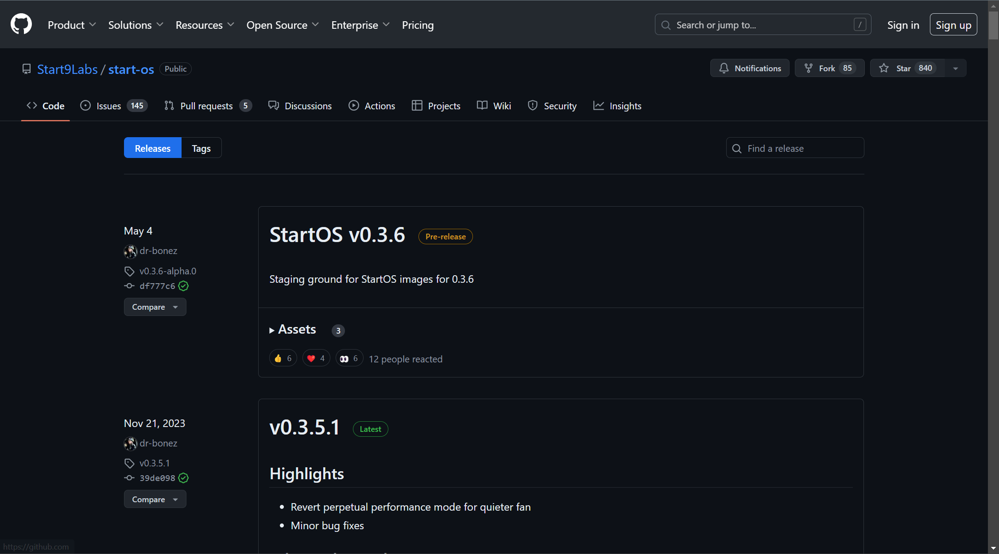
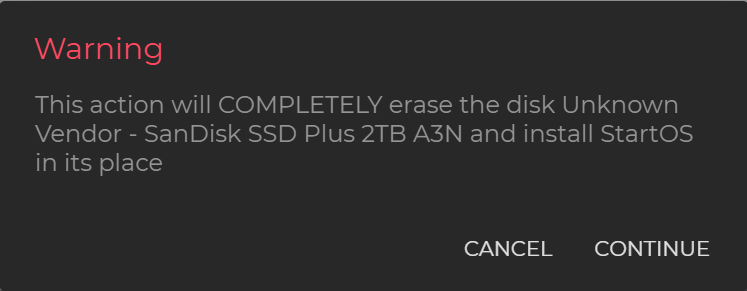

+++
title = 'Creare il proprio nodo'
author = 'me'
date = 2024-10-05
weight = 5
draft = true
+++

> [!important] Brief:
> Questa sezione ti aiuterà a capire cos'è bitcoin e a familiarizzare con le basi del suo funzionamento.

Description here

# Installazione StartOS

## Scaricare StartOS

1) Cliccare su questo [link](https://github.com/Start9Labs/start-os/releases/)

2) Clicca sull'ultima release, taggata come "Latest"

	

3) Scorrere in fondo alla pagina e cliccare sul file che termina con "x86_64.iso"

	

## Creare una ISO di StartOS per il boot

4) Scaricare [Balena Hetcher](https://etcher.balena.io/#download-etcher)

5) Scorrere lungo la pagina e cliccare sul file relativo al proprio sistema operativo (il sistema operativo che si usa abitualmente sul proprio PC, __non__ il sistema operativo del full node)

6) Collegare una chiavetta USB al proprio PC

8) Avviare Balena Hetcher

	

9) Cliccare su "Flash from file" e selezionare il file di StartOS (con estensione .iso) scaricato precedentemente

11) Cliccare su "Select target" e selezionare la chiavetta USB (precedentemente collegata al PC)

13) Cliccare su "Flash!" e attendere il completamento

## Installare StartOS sul Nodo

14) Collegare monitor, tastiera, mouse e alimentazione al Nodo ed infine, collagare la chiavetta USB con la ISO di StartOS per il boot

15) Accendere il Nodo e, mentre si avvia (fin dai primi istanti dopo averlo acceso) premere ripetutamente il tasto ESC (o il tasto F4, o F8, in funzione dell'hardware utilizzato), fino a quando comparirà la schermata del BIOS

	

16)  Utilizzando i tasti freccia della tastiera, selezionare la scheda "Boot" e scorrere fino alla voce "Boot Option #1", quindi premere INVIO e selezionare la chiavetta USB inserita

17) Selezionare la scheda "Save & Exit", scorrere su "Save Changes and Exit" e premere INVIO

18) Attendere il riavvio e l'inizializzazione dell'installazione di StartOS, quindi selezionare l'SSD su cui effettuare l'installazione

	

19) Cliccare su "Install StartOS" e confermare cliccando CONTINUE

	
	

20) Attendere il completamento dell'installazione, quindi rimuovere la chiavetta USB dal Nodo e cliccare su REBOOT

	

21) Se tutto è andato a buon fine, comparirà questa schermata:

	ciao
