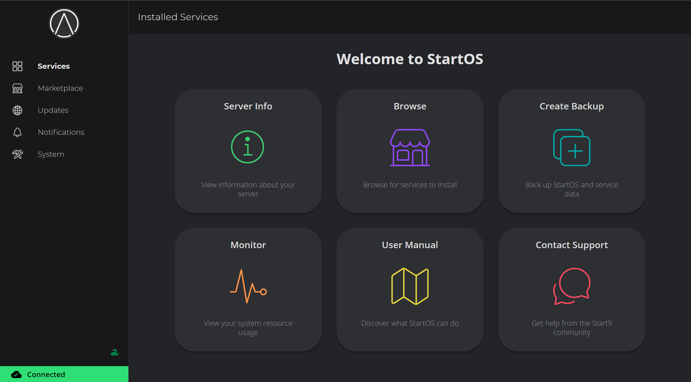

+++
title = 'Creare il proprio nodo'
author = 'me'
date = 2024-10-05
weight = 5
draft = false
+++

> [!important] Brief:
> Questa sezione ti guiderà nella preparazione di un nodo bitcoin personale e a familiarizzare con le basi del suo funzionamento.

### Perchè possedere un nodo privato

Operare con Bitcoin tramite un nodo privato ti permette di avere il pieno controllo delle tue transazioni e dei tuoi fondi, proteggendo la tua privacy in modo più efficace rispetto all'uso di servizi di terze parti. Con un nodo privato, non dipendi da intermediari per verificare le transazioni, evitando che i tuoi dati personali vengano tracciati o esposti. Inoltre, contribuisci alla sicurezza e alla decentralizzazione della rete Bitcoin, senza affidarti a piattaforme che potrebbero monitorare o censurare le tue attività. In sintesi, un nodo privato ti offre maggiore autonomia, sicurezza e privacy.

# Hardware necessario

Acquistare un mini PC per creare il proprio nodo Bitcoin è una scelta vantaggiosa poichè sono compatti, silenziosi e richiedono poca energia, il che li rende ideali per un funzionamento continuo senza incidere troppo sui consumi elettrici.
### HP EliteDesk 800 G3

Dispositivi ricondizionati sono facilmente reperibili online. Si consiglia l'acquisto separato di un SSD NVMe PCIe3.0 da almeno 2TB.

- CPU: Intel Core i5 gen6 - 2.4GHz
- RAM: 16GB DDR4
- SSD: 1 slot SATA III 2.5'' 6GB/s, 1 slot M.2 NVMe PCIe3.0
- Power: DC 19.5V 3.33A - 65W

### Acemagic S1 N95

Facilmente reperibile su Amazon o sul [sito del produttore](https://acemagic.eu/products/s1-minipc). Si consiglia l'acquisto separato di un SSD NVMe PCIe3.0 da almeno 2TB.

- CPU: Intel Alder Lake N95 - 1.7GHz
- RAM: 16GB DDR4
- SSD: 1 slot M.2 NVMe PCIe3.0, 1 slot M.2 SATA
- Power: DC 12V 4A - 48W

---

# Installazione StartOS

### Scaricare StartOS

1) Cliccare su questo [link](https://github.com/Start9Labs/start-os/releases/)

2) Clicca sull'ultima release, taggata come "Latest"

	

3) Scorrere in fondo alla pagina e cliccare sul file che termina con "x86_64.iso"

	

### Creare una ISO di StartOS per il boot

4) Scaricare [Balena Hetcher](https://etcher.balena.io/#download-etcher)

5) Scorrere lungo la pagina e cliccare sul file relativo al proprio sistema operativo (il sistema operativo che si usa abitualmente sul proprio PC, __non__ il sistema operativo del full node)

6) Collegare una chiavetta USB al proprio PC

8) Avviare Balena Hetcher

	

9) Cliccare su "Flash from file" e selezionare il file di StartOS (con estensione .iso) scaricato precedentemente

11) Cliccare su "Select target" e selezionare la chiavetta USB (precedentemente collegata al PC)

13) Cliccare su "Flash!" e attendere il completamento

### Installare StartOS sul Nodo

14) Collegare monitor, tastiera, mouse e alimentazione al Nodo ed infine, collagare la chiavetta USB con la ISO di StartOS per il boot

15) Accendere il Nodo e, mentre si avvia (fin dai primi istanti dopo averlo acceso) premere ripetutamente il tasto ESC (o il tasto F4, o F8, in funzione dell'hardware utilizzato), fino a quando comparirà la schermata del BIOS

	

16)  Utilizzando i tasti freccia della tastiera, selezionare la scheda "Boot" e scorrere fino alla voce "Boot Option #1", quindi premere INVIO e selezionare la chiavetta USB inserita

17) Selezionare la scheda "Save & Exit", scorrere su "Save Changes and Exit" e premere INVIO

18) Attendere il riavvio e l'inizializzazione dell'installazione di StartOS, quindi selezionare l'SSD su cui effettuare l'installazione

	

19) Cliccare su "Install StartOS" e confermare cliccando CONTINUE

	
	

20) Attendere il completamento dell'installazione, quindi rimuovere la chiavetta USB dal Nodo e cliccare su REBOOT

	

21) Se tutto è andato a buon fine, comparirà questa schermata. Cliccare su "Start Fresh" e quindi selezionare l'SSD 

	
	

22) Inserire una password, ri-scriverla per conferma e quindi cliccare su FINISH.

	

23) Attendere l'inizializzazione di StartOS

	

24) Al termine dell'inizializzazione, sarà possibile loggarsi per accedere al proprio nodo

	
	

25) DESCRIVERE DI PRENDERE L'IP O L'HOST NAME

---

# Configurazione StartOS

### Accesso a StartOS da rete LAN

### Installazione di Bitcoin Core

### Installazione di Electrs

### Installazione di Mempool

---

# Preparazione del Wallet

### Installazione Sparrow Wallet

### Configurazione Sparrow Wallet

### Creazione/Importazione Wallet

### Transare tramite il proprio nodo
